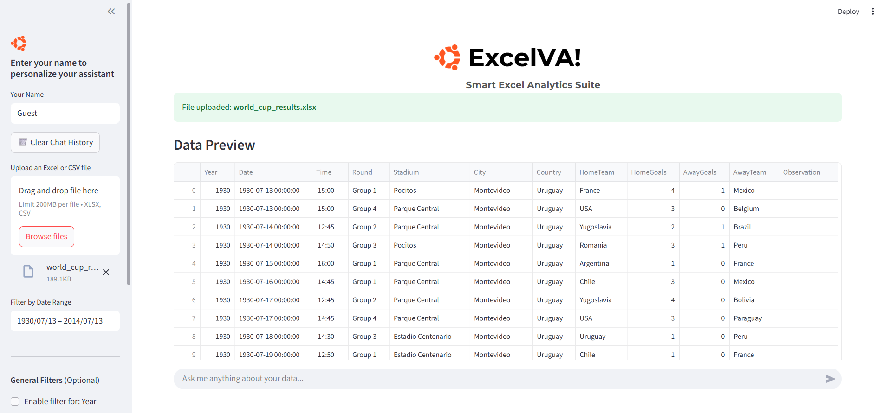
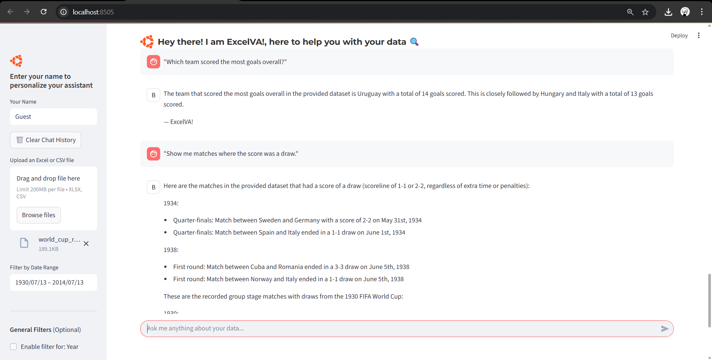

# 📊 ExcelVA! — Smart Excel Analytics Suite


**ExcelVA!** is an AI-powered, interactive Excel dashboard built with Streamlit and Cohere that enables you to upload, analyze, visualize, and chat with your Excel or CSV data like never before — no code required.

---

## 🚀 Features

📁 Upload Excel or CSV files

🧠 AI-powered Chatbot (Cohere API)

📊 Interactive Charts (Plotly)

Histogram

Bar Chart (Grouped)

Pie Chart

Line Trend Chart

📅 Date, Numeric & Categorical Filters

💬 Formula Assistant: Explain or generate Excel formulas

🤖 AI Chatbot that answers data questions contextually

🗑️ Option to clear chat history

---


## 🌟 Project Highlights

1. Built a context-aware GenAI assistant that analyzes Excel data and dynamically answers user queries using a real-time LLM (Cohere).  

2. Integrated LLM prompting with actual sample data (top 50 rows) for contextual and accurate replies.  

3. Enabled automated Excel tasks through both formula generation and data filtering logic.  
 
4. Fully interactive frontend with zero frontend coding using Streamlit.  

---
## 💡 Why It’s a GenAI Project

GenAI isn't just about chatbots — it's about generating human-like responses, solutions, or outputs based on given context.  This project uses:

1. Natural language processing (via Cohere)

2. Context embedding (sampled Excel data)

3. Language→Logic translation (generate/explain formulas)➡️ Making it a textbook example of a GenAI-powered analytics assistant.

---


## 🎯 Use Cases

* Business analysts exploring Excel files
* Students learning Excel logic or formulas
* Data professionals wanting quick insights
* Anyone who wants to "talk to their data"

---

## 🧦 Tech Stack

Python

Streamlit

Plotly

Cohere API

Pandas

XlsxWriter

FPDF

---

## 🛠️ Built With

* [Python](https://www.python.org/)
* [Streamlit](https://streamlit.io/)
* [Plotly](https://plotly.com/python/)
* [Cohere API](https://cohere.com/) — AI-powered Excel assistant
* [Pandas](https://pandas.pydata.org/)
* [FPDF](https://pyfpdf.readthedocs.io/) — (optional report features)

---

## 📸 Screenshots

| Upload File                             | AI Assistant                        |
| --------------------------------------- | ----------------------------------- |
|  |  |

---

## 🔐 Setup Instructions

1. Clone the repo:

   ```bash
   git clone https://github.com/your-username/excelva-analytics.git
   cd excelva-analytics
   ```

2. Create a virtual environment (optional but recommended):

   ```bash
   python -m venv venv
   source venv/bin/activate  # or venv\Scripts\activate on Windows
   ```

3. Install requirements:

   ```bash
   pip install -r requirements.txt
   ```

4. Create `.streamlit/secrets.toml` and add your [Cohere API key](https://dashboard.cohere.com/api-keys):

   ```toml
   [default]
   COHERE_API_KEY = "your-api-key-here"
   ```

5. Run the app:

   ```bash
   streamlit run streamlit_app.py
   ```

---

## ⚠️ Git Tips

Make sure your `.gitignore` includes:

```
venv/
__pycache__/
*.pyc
*.json
.secrets.toml
```

---

## 🙋‍♀️ Author

**Samruddhi Kulkarni**
MCA Student | AI-ML Enthusiast | Excel + Python Automation Geek  
## 📬 Connect With Me

[](https://www.linkedin.com/in/samruddhi-kulkarni-010315227/)

---

## 📝 License

This project is licensed under the MIT License.    
## ⭐ Star this repo if you found it helpful!
